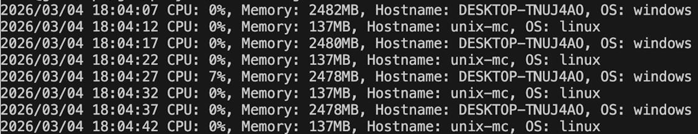

# Environment for launch system metrics
## Example worked

## Quick start
```bash
export PATH=$PATH:/usr/local/go/bin 
export PATH="$PATH:$(go env GOPATH)/bin"

go mod init project
go mod tidy

sudo apt install -y protobuf-compiler # For debian based distros

go install google.golang.org/protobuf/cmd/protoc-gen-go@latest 
go install google.golang.org/grpc/cmd/protoc-gen-go-grpc@latest 

protoc --go_out=. --go-grpc_out=. proto/agent.proto 
```
## In folder object calls where place main.go do:
```bash
go run .
```
